<div id="top">
<!-- HEADER STYLE: CLASSIC -->
<div align="center">

# CRACK_THE_INTERVIEW

<em>Sharpening my technical interview skills through consistent practice</em>

<!-- BADGES -->
<!-- Animated typing effect for title -->
<p align="center">
  
</p>

<!-- Animated wave -->
<p align="center">
  
</p>

<!-- Status badges with better working versions -->
<p align="center">
  
  
  
  
</p>

<!-- Animated tech stack -->
<p align="center">
  
  
  
  
</p>

<!-- Animated coding activity -->
<p align="center">
  
</p>

<!-- Creative ASCII animation -->
<p align="center">
  
</p>

<!-- Activity graph -->
<p align="center">
  
</p>

</div>
<br>

---

## About This Repository

This repo is for me to keep practicing technical interviews since I have been lacking off for a while. I create my own solutions to various coding problems and algorithmic challenges, now with automated testing to ensure code quality and correctness.

Feel free to use my solutions as a way to help you understand the problems and create your own implementations!

## What You'll Find Here

### Problem Categories
- **Strings**: Character manipulation, permutations, palindromes ✅
- **Arrays**: Sorting, searching, two-pointers, sliding window 🚧
- **Data Structures**: Linked Lists, Trees, Graphs, Hash Tables 🚧
- **Algorithms**: Dynamic Programming, Greedy Algorithms, Recursion 🚧
- **System Design**: Scalability concepts and architecture patterns 📋

### Current Solutions

<!-- Animated progress bars -->
<p align="center">
  
</p>

#### 🧵 Strings (`strings/`) - ✅ **COMPLETE**
- 🔤 `isUnique.py` - Check if string has all unique characters  
- 🔄 `isPermutation.py` - Determine if two strings are permutations  
- 🌐 `URLify.py` - Replace spaces with %20  
- 🔄 `palindromPermutation.py` - Check if string can form palindrome  
- ✏️ `oneAway.py` - Determine if strings are one edit away  

<!-- Progress visualization -->
<details>
<summary>📊 Progress Overview</summary>
<br>

```
Strings:    ████████████████████████████████████████ 100% (5/5)
Arrays:     ░░░░░░░░░░░░░░░░░░░░░░░░░░░░░░░░░░░░░░░░   0% (0/10) 🚧
DSA:        ░░░░░░░░░░░░░░░░░░░░░░░░░░░░░░░░░░░░░░░░   0% (0/15) 🚧
Total:      █████████████░░░░░░░░░░░░░░░░░░░░░░░░░░░  33% (5/30)
```

**🎯 Next Milestone**: Arrays & Two Pointers  
**🔥 Current Streak**: Testing all solutions automatically!

</details>

### Solution Structure
Each problem typically includes:
- Problem statement and constraints
- My approach and thought process
- Code implementation with comments
- Comprehensive test coverage
- Time and space complexity analysis
- Alternative solutions when applicable

### Languages Used
I primarily solve problems in:
- Python (for rapid prototyping and clarity)

## Getting Started

### Prerequisites
- Python 3.8+ 
- Basic understanding of data structures and algorithms
- Familiarity with at least one programming language

### Using This Repository
1. **Clone the repository:**
   ```bash
   git clone https://github.com/megane18/crack_the_interview
   cd crack_the_interview
   ```

2. **Set up the environment:**
   ```bash
   python -m venv myenv
   source myenv/bin/activate  # On Windows: myenv\Scripts\activate
   pip install -r requirements.txt
   ```

3. **Run the tests:**
   ```bash
   pytest tests/ -v
   ```

4. **Browse by topic or difficulty:**
   - Navigate to specific folders for different problem types
   - Each solution includes detailed explanations

## Automated Testing & CI/CD

<!-- Animated CI/CD visualization -->
<p align="center">
  
</p>

This repository uses **GitHub Actions** for continuous integration:

<div align="center">

| Feature | Status | Description |
|---------|--------|-------------|
| 🧪 **Automated Testing** |  | All solutions tested on every push/PR |
| 🨠**Code Quality** |  | `black` and `flake8` formatting checks |
| 📊 **Test Coverage** |  | Comprehensive test coverage reporting |
| 🐍 **Multi-Python** |  | Tested across Python versions |

</div>

<!-- Workflow visualization -->
<details>
<summary>🔄 CI/CD Workflow Details</summary>
<br>



</details>

```mermaid
graph LR
    A[👨‍💻 Code Push] --> B[🚀 GitHub Actions]
    B --> C[🧪 Run Tests]
    B --> D[🎨 Code Linting]
    B --> E[📊 Coverage Report]
    C --> F{✅ All Pass?}
    D --> F
    E --> F
    F -->|Yes| G[✅ Deploy Success]
    F -->|No| H[❌ Build Failed]
    H --> I[🔧 Fix Issues]
    I --> A
```

### Running Tests Locally
```bash
# Run all tests
pytest tests/ -v

# Run specific test file
pytest tests/test_strings.py -v

# Run with coverage
pytest tests/ --cov=. --cov-report=term-missing

# Run linting
black --check .
flake8 . --max-line-length=88
```

## My Practice Strategy

### Daily Goals
- Solve at least 1-2 problems per day
- Focus on understanding patterns rather than memorizing solutions
- Practice explaining my thought process out loud
- Time myself to simulate real interview conditions
- Write comprehensive tests for each solution

### Progress Tracking
- Keep notes on challenging problems
- Review and optimize previous solutions
- Practice problems from different companies
- Mock interviews with friends/peers
- Maintain test coverage above 90%

## Resources I Use

- **LeetCode**: For algorithmic problems
- **HackerRank**: For structured practice
- **Cracking the Coding Interview**: Classic preparation book
- **System Design Primer**: For system design concepts
- **Pramp/InterviewBit**: For mock interviews

## Contributing

While this is primarily my personal practice repo, I welcome:
- Suggestions for better solutions
- New problem recommendations
- Bug fixes in existing code
- Alternative approaches to problems
- Test case improvements

## Project Structure
```
crack_the_interview/
├── .github/workflows/          # GitHub Actions CI/CD
│   └── test.yml               # Automated testing workflow
├── strings/                   # String manipulation problems
│   ├── isUnique.py
│   ├── isPermutation.py
│   ├── URLify.py
│   ├── palindromPermutation.py
│   └── oneAway.py
├── arrays/                    # Array problems (coming soon)
├── dsa/                      # Data structures & algorithms (coming soon)
├── tests/                    # Test suite
│   ├── conftest.py
│   ├── test_strings.py
│   ├── test_arrays.py
│   └── test_dsa.py
├── requirements.txt          # Python dependencies
└── README.md
```

## Disclaimer

These are my personal solutions developed during my learning process. They may not always be the most optimal, but they represent my understanding and approach to each problem. All solutions are tested and verified to work correctly. Always strive to understand the logic and create your own solutions!

---

<!-- Animated footer -->
<p align="center">
  
</p>

<p align="center">
  
</p>

<!-- Contribution stats -->
<p align="center">
  
</p>

<div align="left"><a href="#top">⬆ Return</a></div>